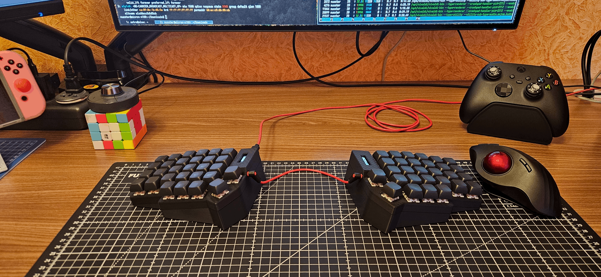
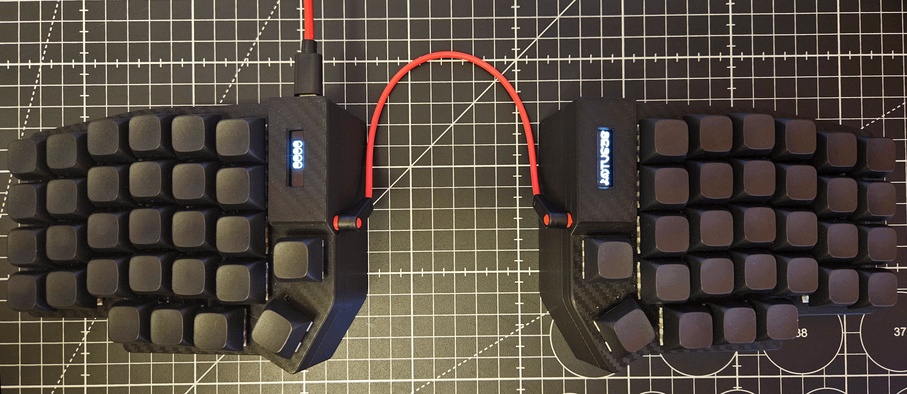

# Keyboard configuration with QMK firmware when using a Vial




## Current keymap
### Layer 0

### Layer 1

### Layer 2

### Layer 3


# FAQ
  - [Configure udev rule](#configure-udev-rule)
  - [First time use](https://get.vial.today/manual/first-use.html)

## Configure udev rule
```shell
apt install sudo
export USER_GID=`id -g`; sudo --preserve-env=USER_GID sh -c 'echo "KERNEL==\"hidraw*\", SUBSYSTEM==\"hidraw\", ATTRS{serial}==\"*vial:f64c2b3c*\", MODE=\"0660\", GROUP=\"$USER_GID\", TAG+=\"uaccess\", TAG+=\"udev-acl\"" > /etc/udev/rules.d/59-vial.rules && udevadm control --reload && udevadm trigger'
```
