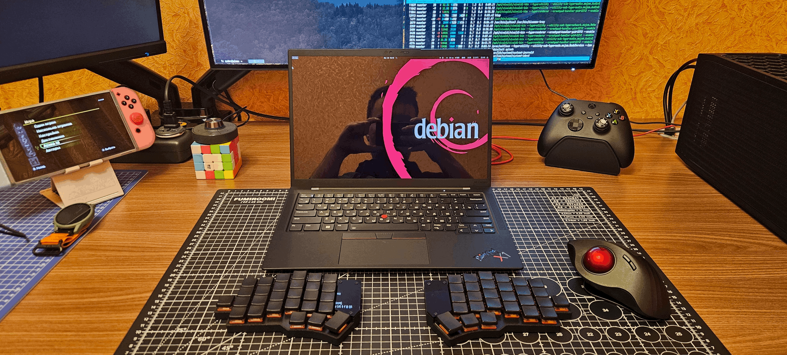
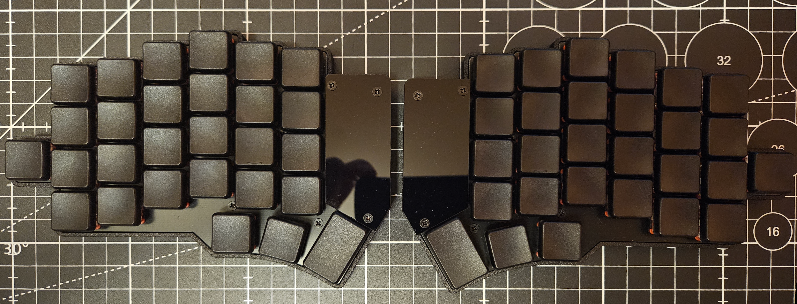
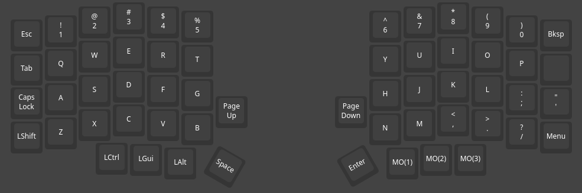
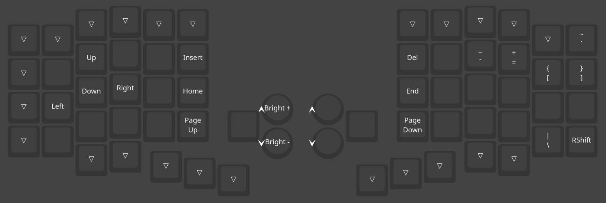
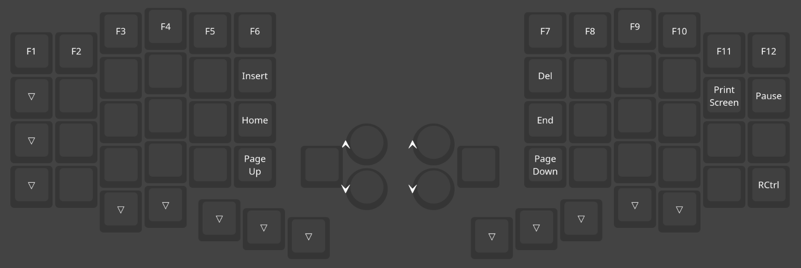
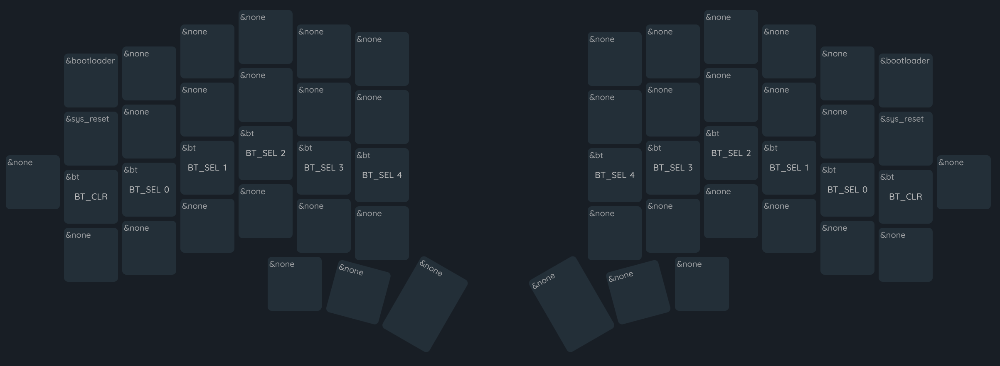

# ZMK Firmware for Dao56 keyboard

## Current keymap
### Layer 0

### Layer 1

### Layer 2

### Layer 3

# FAQ
  - [How to change the keymap?](#how-to-change-the-keymap)
  - [How to flash the keyboard?](#how-to-flash-the-keyboard)
  - [How to pair halves?](#how-to-pair-halves)

## How to change the keymap?
1. Fork this repository
2. Make changes to the [dao.keymap](config/boards/arm/dao/dao.keymap) file in your repository or user [visual editor](https://nickcoutsos.github.io/keymap-editor/)
3. Commit changes to your repository
4. Go to `Actions` tab in your repository
5. Wait for the GitHub Action to complete
6. Grab `firmware.zip` file - it contains firmware for both of your halves

## How to flash the keyboard?
1. Obtain `firmware.zip`
2. Unzip `firmware.zip` - you should have `dao_left.uf2` and `dao_right.uf2` files
3. Turn off the power for selected halve (move slider to position `OFF`)
4. Connect selected halve to the PC via USB-C cable
5. Press `RESET` button **twice** to enter DFU mode - you should see new USB device in your file manager
6. Copy the corresponding firmware to the root directory of the new USB device
7. Disconnect selected halve from the PC
8. Repeat steps 3-7 for the other halve

## How to pair halves?
1. Turn off the power for both halves (move slider to position `OFF`)
2. Turn on the power for both halves (move slider to position `ON`)
3. Press `RESET` button **once** on both halves **simultaneously**
